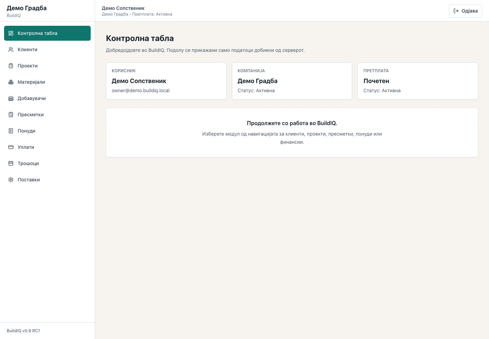
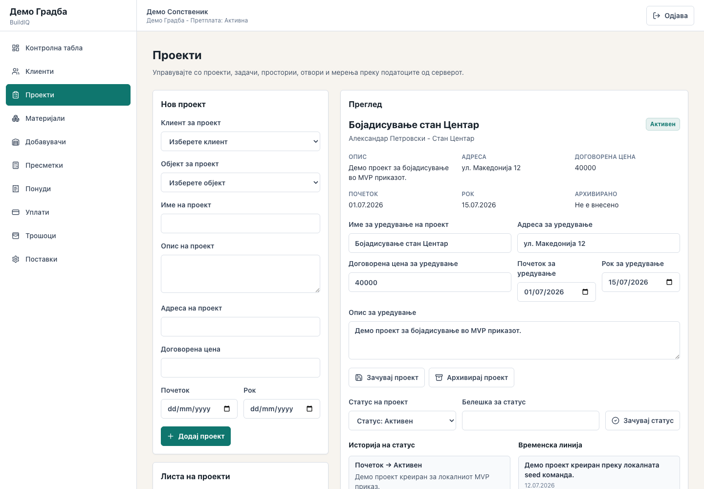
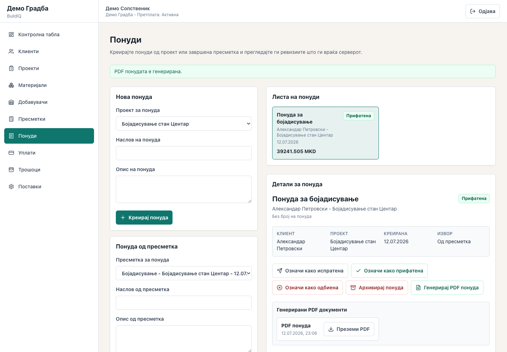
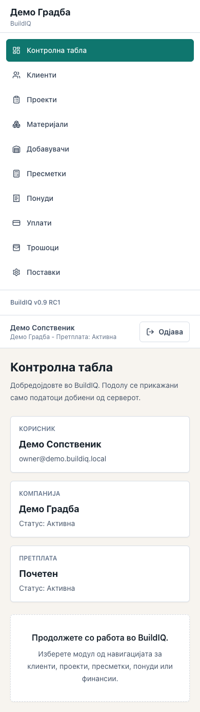

# BuildIQ

## Status

**Release candidate in active development.** BuildIQ currently supports controlled local and isolated review environments. It is not represented as generally available or production-ready.

- **Implemented:** authenticated tenant-scoped workflows for companies, customers, properties, projects, tasks, rooms, measurements, painting calculations, materials, procurement, estimates, PDF offers, payments, expenses, subscriptions, roles, and permissions.
- **In development:** broader role/permission coverage, fixed-precision financial storage, hardened state transitions, cross-tab session handling, operational readiness, and additional calculation modules.
- **Future ideas:** carefully bounded AI assistance may be explored later. No AI model, provider SDK, prompt workflow, or AI-generated business decision is implemented in this repository today.

## Executive summary

BuildIQ is a Macedonian-first construction management platform built around deterministic calculations and backend-owned business rules. It combines project and room data, construction measurements, material and supplier information, estimates, payments, expenses, and generated documents inside explicit company boundaries.

The repository is an engineering case study in domain modelling, tenant isolation, authorization, financial workflow design, document generation, API contracts, product interfaces, testing, and release discipline.

## Why BuildIQ exists

Construction work is often coordinated across disconnected spreadsheets, messages, handwritten measurements, informal price lists, and manually prepared offers. BuildIQ explores how those workflows can share one auditable domain model without moving authoritative calculations or financial rules into the browser.

The product is intentionally Macedonian-first at the interface and document layers. Code, APIs, database identifiers, and engineering documentation remain in English.

## Core capabilities

### Implemented

- JWT authentication and current-session bootstrap
- Company-scoped customer, property, project, room, task, and measurement workflows
- Deterministic painting calculation engine with assumptions, warnings, and line items
- Materials, suppliers, price books, and procurement records
- Versioned estimates with backend-owned totals
- Macedonian PDF offer generation and protected document download
- Project payments, expenses, and financial summaries
- Subscription state and feature-access foundations
- Role and permission enforcement for reviewed sensitive routes
- Audit events for selected security and business mutations
- React product interface with responsive navigation and tested empty/error states

### In development

- Complete authorization coverage across every mutation family
- Fixed-precision money and explicit currency/rounding rules
- Stronger immutable financial state transitions
- Wider audit-event coverage
- Hardened multi-tab authentication and tenant-aware client caching
- Tile, Knauf, flooring, and additional construction calculation engines
- Production-readiness and operational verification

### Future ideas

- Human-reviewed assistance for document preparation or workflow guidance
- Additional integrations through explicitly bounded interfaces
- Expanded reporting and operational analytics

Future ideas are not implemented capabilities or delivery commitments.

## Architecture overview

BuildIQ uses a React/TypeScript client and a FastAPI application backed by PostgreSQL. The API owns authorization, company scoping, business state transitions, calculations, financial totals, and PDF generation. The browser renders API results and submits intent; it does not calculate authoritative quantities, prices, totals, balances, or document content.

See [Architecture](docs/architecture.md) for context and container diagrams, domain boundaries, authentication, authorization, subscriptions, jobs, storage, and notifications.

## Technology stack

| Layer | Technology |
|---|---|
| Frontend | React 19, TypeScript, Vite, Tailwind CSS, TanStack Query, React Hook Form, Zod |
| Backend | Python, FastAPI, Pydantic, SQLAlchemy, Alembic |
| Database | PostgreSQL; SQLite is used only by isolated tests and local audit fallbacks |
| Authentication | JWT bearer tokens with server-side user/company validation |
| Documents | ReportLab-generated PDF offers with protected metadata and download routes |
| Quality | pytest, Vitest, Testing Library, ESLint, TypeScript, exported OpenAPI contract |

## Security philosophy

- Treat company scope as a server-side invariant, not a client filter.
- Enforce permissions at API boundaries; frontend visibility is secondary.
- Keep construction calculations, financial totals, and PDF generation on the backend.
- Reject unsafe production configuration rather than relying on operator memory.
- Preserve important business history through archive, reversal, and versioned records.
- Keep credentials, private data, environment topology, and operational runbooks outside the public repository.
- Validate with negative authorization and tenant-isolation tests, not only happy paths.

See [Security policy](SECURITY.md), [Security architecture](docs/014-security.md), and [Security Sprint 1](docs/035-security-sprint-1.md).

## Screenshots

Screenshots are captured from the current application using the repository's sanitized local demonstration workflow. They do not contain production, customer, or confidential data.

| Dashboard | Project workflow |
|---|---|
|  |  |

| Documents |
|---|
|  |

| Responsive product interface |
|---|
|  |

Worker management and permission management do not yet have dedicated frontend surfaces. They are therefore not represented by fabricated screenshots; current role and permission evidence is documented in the architecture and automated tests.

## Local installation

Prerequisites: Python 3.12+, Node.js 20.19+ (or 22.12+), npm, Docker with Compose, and Git.

```bash
python3 -m venv .venv
.venv/bin/python -m pip install --upgrade pip
.venv/bin/python -m pip install -e './backend[dev]'
cp .env.example .env
docker compose up -d postgres
(cd backend && ../.venv/bin/alembic upgrade head)
```

Seed the explicitly local demonstration environment with unique local-only passwords:

```bash
(cd backend && \
  BUILDIQ_SEED_HQ_PASSWORD='SET_UNIQUE_LOCAL_PASSWORD_1' \
  BUILDIQ_SEED_OWNER_PASSWORD='SET_UNIQUE_LOCAL_PASSWORD_2' \
  BUILDIQ_SEED_ALEKSANDAR_PASSWORD='SET_UNIQUE_LOCAL_PASSWORD_3' \
  BUILDIQ_SEED_HRISTIJAN_PASSWORD='SET_UNIQUE_LOCAL_PASSWORD_4' \
  ../.venv/bin/buildiq-seed-dev)
```

Run the services in separate terminals:

```bash
(cd backend && ../.venv/bin/uvicorn app.main:app --reload)
(cd frontend && npm ci && cp .env.example .env && npm run dev)
```

Example files contain placeholders only. Never use demonstration credentials or settings outside an isolated local environment.

## Testing

```bash
(cd backend && ../.venv/bin/pytest)
(cd frontend && npm ci && npm test -- --run)
(cd frontend && npm run lint)
(cd frontend && npm run build)
```

Dependency review:

```bash
.venv/bin/python -m pip check
(cd frontend && npm audit)
```

This repository is Python/FastAPI plus React; Composer and Artisan commands do not apply.

## Documentation map

- [Architecture](docs/architecture.md)
- [Project overview](docs/001-project-overview.md)
- [Domain model](docs/003-domain-model.md)
- [Business rules](docs/006-business-rules.md)
- [Calculation engine](docs/007-calculation-engine-framework.md)
- [Security architecture](docs/014-security.md)
- [Development standards](docs/015-development-standards.md)
- [PDF system](docs/030-pdf-system.md)
- [Local demonstration flow](docs/031-mvp-demo-flow.md)
- [Release-candidate checklist](docs/032-release-candidate-checklist.md)
- [Generic deployment principles](docs/033-deployment-principles.md)
- [RC1 audit](docs/034-buildiq-v0.9-rc1-audit.md)
- [Security Sprint 1](docs/035-security-sprint-1.md)
- [Dependency remediation review](docs/036-dependency-remediation-review.md)
- [Dependency upgrade compatibility](docs/037-dependency-upgrade-compatibility.md)
- [OpenAPI contract](docs/api/openapi.json)
- [User guide](docs/user-guides/buildiq-user-guide-mk.md)
- [Changelog](CHANGELOG.md)

Earlier blueprint documents describe target-state design. The exported OpenAPI contract and current backend/frontend code are authoritative for implemented behavior.

## Roadmap

1. Close remaining authorization, financial integrity, session, and state-transition risks.
2. Complete the reviewed release-candidate gate and PostgreSQL validation.
3. Expand calculation modules without moving business logic into the client.
4. Improve auditability, error recovery, and operational readiness.
5. Evaluate future assistance only behind explicit security, review, and accountability boundaries.

See [Roadmap](docs/010-roadmap.md) and [Product backlog](docs/018-product-backlog.md). Planned work is not an implementation claim.

## License

No open-source license has been granted. The source is publicly visible for review, but all rights are reserved unless and until the owner explicitly approves a license. Dependency licenses remain governed by their respective packages.

## Disclaimer

BuildIQ is active engineering work and is provided without warranty. Public examples and screenshots use sanitized local demonstration data. The repository does not claim customers, adoption, revenue, commercial success, or production availability. Do not use it as authoritative construction, pricing, accounting, legal, or safety advice.
