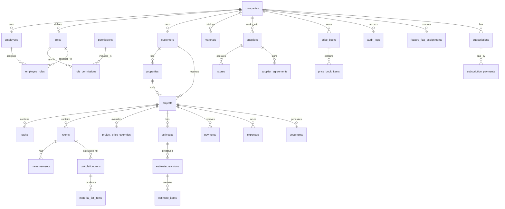

# Entity Relationships

This document describes conceptual relationships for BuildIQ Blueprint v1.0. It is not a migration file.

## Tenant Boundary

`companies` is the tenant root.

All customer-owned data must include `company_id`.

Internal BuildIQ HQ records may be platform-scoped, but they must not bypass authorization rules.

## Relationship Map

## Core Relationship Rules

- A company can have many employees.
- An employee belongs to one company.
- A role belongs to one company unless it is a system role template.
- A role can contain many permissions.
- An employee can have many roles.
- A customer belongs to one company.
- A customer can have many properties.
- A project belongs to one company and one customer.
- A project can optionally belong to one property.
- A project can have many tasks, rooms, estimates, payments, expenses, and documents.
- A room belongs to one project.
- A measurement belongs to one room and one project.
- A calculation run belongs to one project and may belong to one room.
- Material list items belong to one project and may be linked to a calculation run.
- Suppliers and stores belong to a company.
- Supplier agreements belong to a company and supplier.
- Price books belong to a company and may be linked to suppliers.
- Project price overrides belong to a project and preserve project-specific pricing decisions.
- Estimates belong to projects.
- Estimate revisions belong to estimates and must preserve historical offer versions.
- Payments and expenses belong to projects and must preserve history.

## History Relationships

The following relationships must preserve historical snapshots:

- Estimate to estimate revision
- Estimate revision to estimate items
- Supplier agreement to agreement terms
- Price book to price book items
- Project price override to project material price
- Payment to project financial state
- Expense to project financial state
- Generated document to source estimate revision

## Feature Flags

Feature flags may be global, company-scoped, or employee-scoped.

Resolution order:

1. Employee assignment
2. Company assignment
3. Global default

## Audit Logs

Audit logs should link to:

- Company
- Acting employee
- Entity type
- Entity ID
- Action
- Before snapshot where useful
- After snapshot where useful
- Timestamp

Audit logs must not be hard-deleted.
