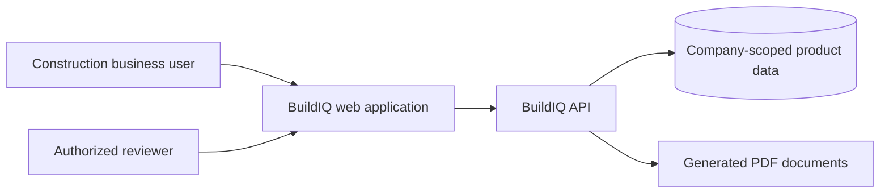
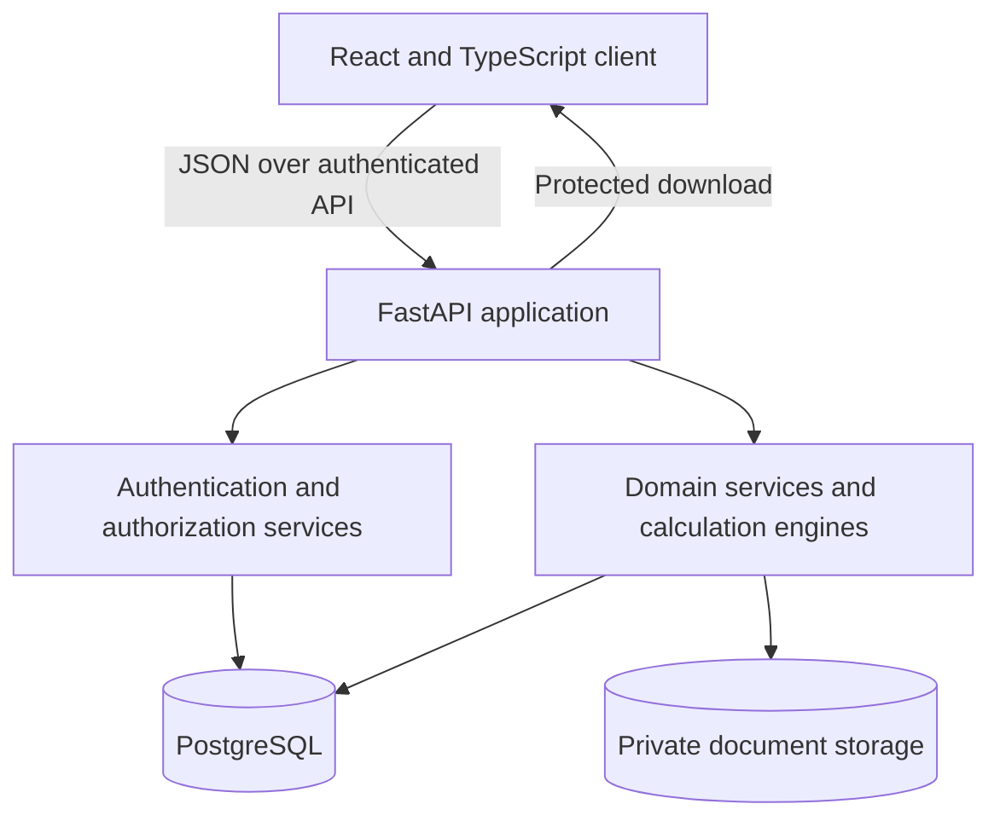

# BuildIQ Architecture

This document describes the implemented release-candidate architecture and clearly marks boundaries that are not yet implemented. Diagrams are conceptual and intentionally omit environment-specific hosts, paths, ports, credentials, and production topology.

## Context diagram

## Container diagram

An exported SVG version of the container diagram is available at [`docs/architecture.svg`](architecture.svg). The Mermaid source used to generate it is [`docs/architecture.mmd`](architecture.mmd).

## Domain boundaries

| Boundary | Responsibilities | Current state |
|---|---|---|
| Identity and tenancy | Users, companies, memberships, roles, permissions, current tenant | Implemented; wider permission coverage remains in development |
| Subscription | Plans, company subscription state, feature-access foundation | Implemented foundation |
| Customers and properties | Company-owned customer and property records | Implemented |
| Projects and tasks | Project lifecycle, agreed price, tasks, archive behavior | Implemented; state hardening remains in development |
| Rooms and measurements | Rooms, openings, measurement sets, authoritative geometry inputs | Implemented |
| Calculations | Deterministic engine registry, painting calculations, output assumptions and warnings | Painting implemented; other engines are future work |
| Materials and procurement | Materials, suppliers, price books, supplier agreements, resolved prices | Implemented foundation |
| Estimates and documents | Revisions, line items, totals, statuses, PDF metadata and generation | Implemented; immutable state rules remain in development |
| Financial | Payments, allocations, expenses, reversals, project summaries | Implemented; fixed-precision migration remains in development |
| Audit | Selected authentication and business mutation events | Partially implemented |

Every company-owned query and mutation must bind to the authenticated company on the server. Client-provided company identifiers are not authorization evidence.

## Authentication

The API verifies email/password credentials, returns a signed JWT, and resolves the current user on protected requests. The session bootstrap loads the current user, company, and subscription before rendering protected routes. Production configuration rejects known development secrets, unsafe debug settings, and invalid origin/storage configuration.

Tokens are currently stored by the browser client. Same-tab logout/login clears authenticated state and cached queries. Cross-tab replacement hardening remains in development and is tracked as a release risk.

## Authorization

Role and permission records are persisted per company membership. Backend dependencies enforce reviewed permissions on sensitive route families; frontend control visibility is a usability layer, never the security boundary. Negative tests cover owner, manager, worker, and cross-tenant behavior for the reviewed scope.

Authorization coverage is not yet complete across every mutation. The release gate requires an explicit route-to-permission matrix and negative test coverage before production readiness can be claimed.

## Subscription model

Companies have subscriptions associated with plans and feature flags. The current session exposes subscription state so the product can explain access. Backend enforcement remains authoritative. Subscription records do not replace permissions: an enabled feature still requires an authenticated and authorized actor.

## Background jobs

No external queue or background worker is implemented in the current release candidate. Calculations and PDF generation execute synchronously inside reviewed API requests. Future background processing must define idempotency, company scope, retry behavior, dead-letter handling, observability, and authorization context before adoption.

## Storage

PostgreSQL is the intended authoritative datastore. Alembic owns schema migrations. SQLite may be used only in isolated automated tests or explicitly documented local audit fallbacks.

Generated PDF files are written to private server-side storage; metadata remains company-scoped in the database. Downloads pass through authenticated API routes that validate company ownership. The storage root must be an absolute, writable private path in production and must never be served as a public directory.

## Notifications

The frontend currently presents request success, validation, loading, empty, and error states. There is no external email, SMS, push, or notification-delivery subsystem in the current release candidate. Future notification delivery must preserve company scope, avoid sensitive payloads, support delivery auditing, and keep provider credentials private.

## Architectural invariants

- Backend services own calculations, prices, totals, balances, status transitions, and document generation.
- Company scoping and permissions are enforced at API and service boundaries.
- Important financial and estimate history is versioned, reversed, or archived rather than silently overwritten.
- Public documentation and diagrams omit production topology.
- Future AI ideas cannot bypass authorization, tenancy, deterministic rules, review, or auditability.
